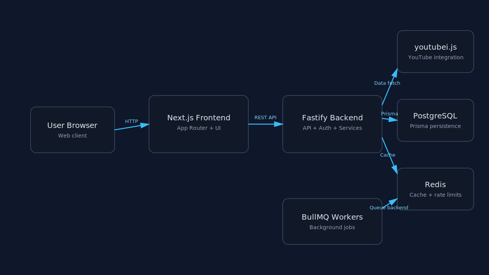
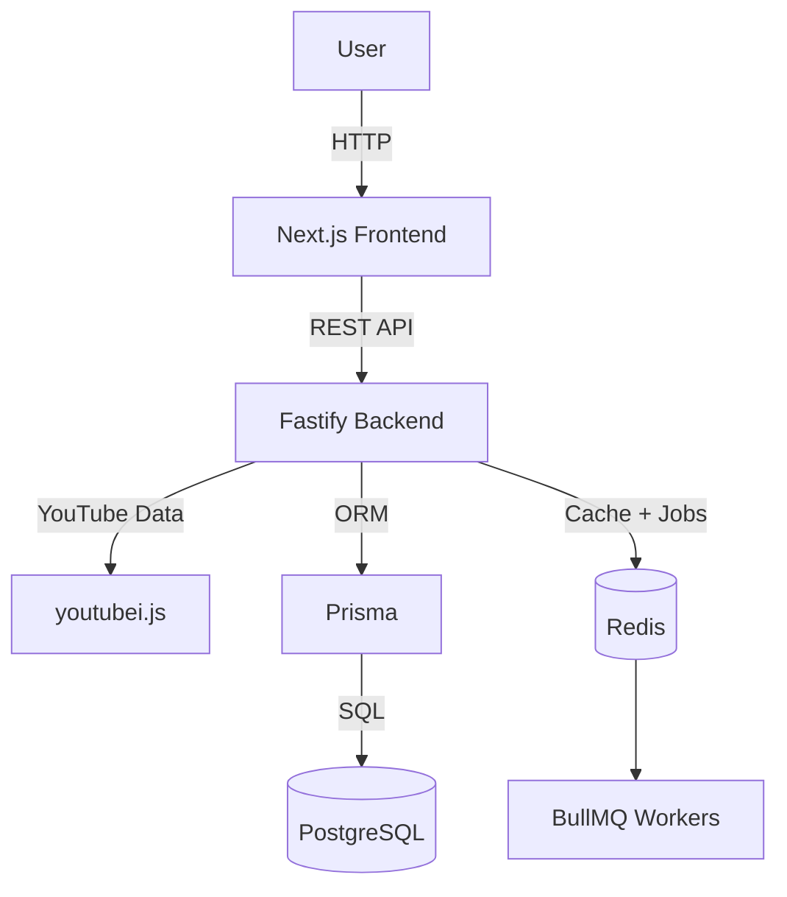

# Vidion - Video Platform

A high-performance full-stack video sharing platform built with Next.js and Fastify.

## Key Features

- [x] Video streaming with quality selection
- [x] YouTube integration via `youtubei.js`
- [x] Watch history with progress tracking
- [x] Adaptive playback support (video + audio streams)
- [x] Live chat and real-time stream features
- [x] Trending, search, and recommendation flows
- [x] Google OAuth + JWT-based authentication
- [x] Playlist and watch-later management

## Demo

Check out the live demo at: **[Add your deployment URL here]**

Example local URLs:
- Frontend: `http://localhost:3000`
- Backend API: `http://localhost:4000`
- API documentation: `http://localhost:4000/docs`

## Architecture Overview

> For detailed architecture notes, see `docs/architecture.md`.





## Tech Stack Details

| Component | Technology | Version |
|-----------|------------|---------|
| Frontend framework | Next.js | 16.1.6 |
| UI library | React | 19.2.3 |
| Frontend language | TypeScript | 5.x |
| Styling | Tailwind CSS | 4.x |
| Backend framework | Fastify | 5.7.x |
| Backend language | TypeScript | 5.8.x |
| YouTube integration | youtubei.js | 16.0.1 |
| ORM | Prisma | 5.x |
| Database | PostgreSQL | 15+ |
| Cache/queues | Redis + BullMQ | Redis 7+ / BullMQ 5.x |

## Getting Started

Install workspace dependencies from the repository root:

```bash
pnpm install
```

### Prerequisites

- Node.js 24.x
- pnpm 9.x
- PostgreSQL database
- Redis (recommended for caching and background jobs)

### Database Setup

1. Create a PostgreSQL database:

```sql
CREATE DATABASE vidion;
```

2. Copy backend environment config:

```bash
cp backend/.env.example backend/.env
```

3. Update `DATABASE_URL` in `backend/.env`.

### Backend Setup

```bash
pnpm --filter vidion-backend db:generate
pnpm --filter vidion-backend db:push  # or pnpm --filter vidion-backend db:migrate
pnpm --filter vidion-backend dev
```

The backend starts on `http://localhost:4000`.

### Frontend Setup

```bash
pnpm --filter frontend dev
```

The frontend starts on `http://localhost:3000`.

## API Endpoints (High-Level)

### Authentication
- `POST /auth/refresh` - Refresh tokens
- `POST /auth/logout` - Logout current session
- `GET /auth/me` - Fetch authenticated user

### Videos
- `GET /videos/:id` - Fetch video details
- `GET /videos/:id/stream` - Resolve stream URL
- `GET /videos/:id/adaptive` - Resolve adaptive audio/video URLs
- `GET /videos/:id/comments` - Fetch comments

### User
- `GET /user/history` - Fetch watch history
- `POST /user/history` - Save/update watch progress
- `GET /user/subscriptions` - Fetch subscriptions

For complete backend endpoints, see `backend/README.md`.

## API Documentation (OpenAPI)

The backend exposes interactive API docs via Swagger UI:

- URL: `http://localhost:4000/docs`
- Plugin setup: `backend/src/plugins/swagger.ts`

## Project Structure

```text
Vidiony/
├── frontend/                  # Next.js app (App Router + UI)
│   ├── src/app/               # Route-based pages
│   ├── src/components/        # Reusable components
│   └── src/lib/               # Shared utilities/services
├── backend/                   # Fastify API server
│   ├── src/modules/           # Domain modules (auth, videos, search...)
│   ├── src/plugins/           # Fastify plugins (prisma, redis, metrics, swagger)
│   ├── src/routes/            # Additional route groups
│   └── prisma/                # Database schema and migrations
├── docs/                      # Final-year project documentation
│   ├── architecture.md
│   ├── database.md
│   └── features.md
└── README.md
```

## Troubleshooting

### 1) `pnpm --filter vidion-backend dev` fails with database errors
- Ensure PostgreSQL is running.
- Verify `DATABASE_URL` in `backend/.env`.
- Run `pnpm --filter vidion-backend db:generate` after schema changes.

### 2) Redis connection warnings in backend logs
- Redis is optional for some flows but required for best performance.
- Start Redis locally or set a valid `REDIS_URL`.

### 3) Frontend cannot reach backend APIs
- Confirm backend is running on `http://localhost:4000`.
- Verify `FRONTEND_URL`/CORS values in `backend/.env`.

### 4) Empty/limited API docs at `/docs`
- Confirm Swagger plugins are installed in backend workspace.
- Restart backend after adding new routes or schema metadata.

## Additional Documentation

- `docs/README.md` - Documentation index and reviewer navigation
- `docs/api.md` - API guide with Swagger/OpenAPI access points
- `backend/README.md` - Detailed backend routes and architecture
- `docs/architecture.md` - System architecture notes
- `docs/database.md` - Database schema guide
- `docs/features.md` - Product feature catalogue

## License

MIT
