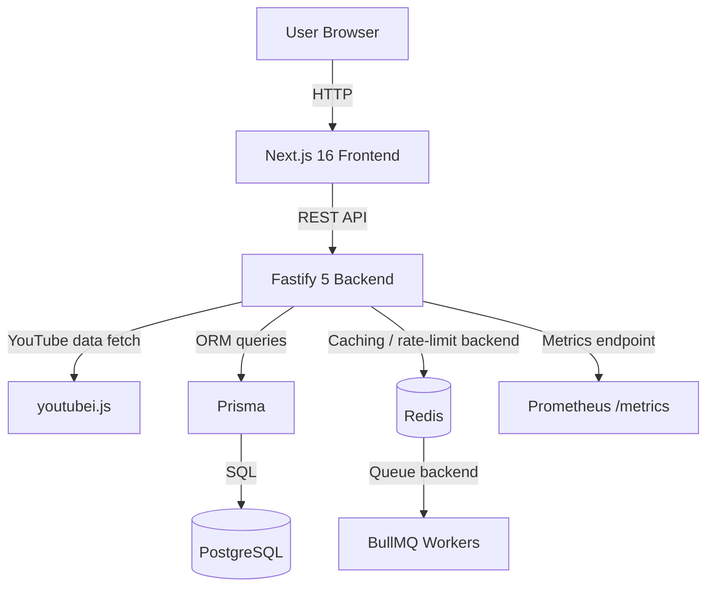

# Architecture Overview

This project follows a full-stack architecture where a Next.js frontend communicates with a Fastify backend, which orchestrates data from YouTube, PostgreSQL, and Redis-backed services.

## System Diagram

## Backend Composition

- **App factory:** `backend/src/app.ts`
- **Entrypoint:** `backend/src/index.ts`
- **Plugins:** `backend/src/plugins/`
  - `prisma.ts`
  - `redis.ts`
  - `metrics.ts`
  - `swagger.ts`
- **Domain modules:** `backend/src/modules/`
  - auth, videos, search, channels, trending, live, users, playlists, recommendations, analytics

## Frontend Composition

- **App Router pages:** `frontend/src/app/`
- **Reusable components:** `frontend/src/components/`
- **Shared client utilities:** `frontend/src/lib/`

## Runtime Flow (High-Level)

1. The user interacts with the Next.js frontend.
2. The frontend calls Fastify APIs for auth, metadata, streams, and user actions.
3. Fastify composes responses using:
   - YouTube source data (`youtubei.js`)
   - PostgreSQL persistence through Prisma
   - Redis cache where available
4. Worker jobs (BullMQ) handle periodic and background tasks.
5. Operational metrics are exposed via `/metrics`.

## Notes

- This architecture is optimized for fast iteration in local development and modular scaling in production.
- API documentation is available through Swagger UI at `http://localhost:4000/docs`.
