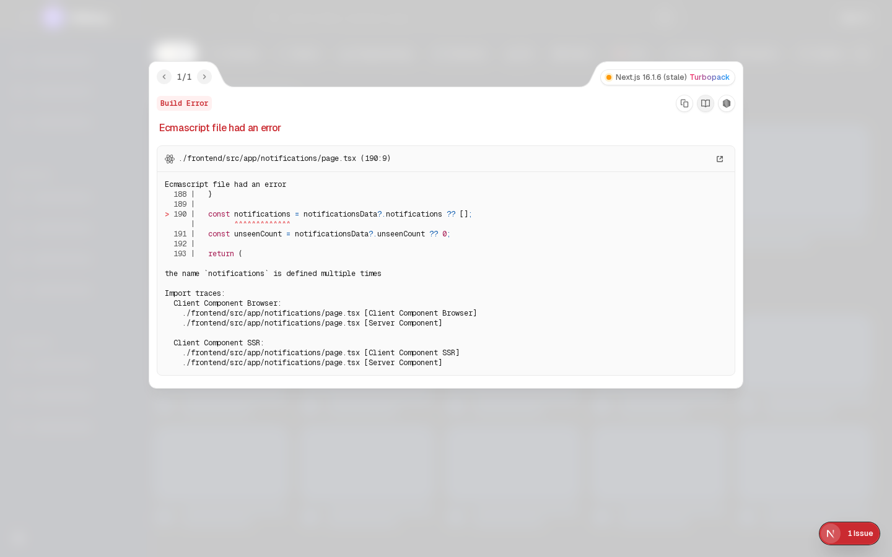

# Features

This document summarizes the platform capabilities for final-year project review.

## Video Playback

High-quality playback with adaptive source handling, stream proxy support, and progress-aware resume behavior.

## Search and Discovery

Search supports filters (type, sort, date, duration) with suggestion endpoints and multiple discovery surfaces (trending/feed/recommendations).

## Watch History

Tracks per-user playback progress and last-watched metadata for continue-watching experiences.

## Authentication and Sessions

Google OAuth + JWT flow with refresh token sessions and secure logout handling.

## Playlists and Watch Later

Users can organize videos into playlists and maintain watch-later queues.

## Live and Community Features

Live stream data and chat flows are integrated for real-time engagement scenarios.

## Notes for Reviewers

- Screenshots currently reuse available frontend captures for documentation completeness.
- Replace with dedicated feature screenshots before final submission.
